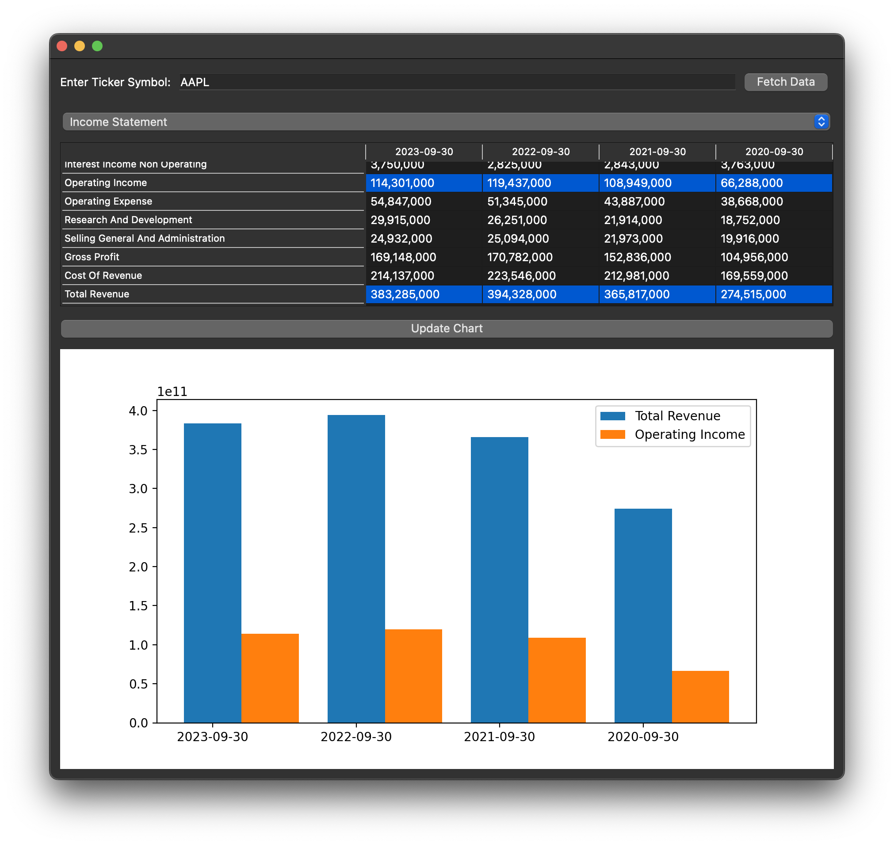

# Stock Analysis
**A Financial Statement Visualization Tool**


## Overview
This Python application provides a graphical interface to visualize key financial metrics from income statements, cash flows, and balance sheets of publicly traded companies, using data sourced from Yahoo Finance. The application utilizes PyQt5 for the GUI and Matplotlib for plotting, allowing users to dynamically select a ticker symbol and view financial data interactively.

## Features
- **Dynamic Ticker Input**: Enter any ticker symbol of a publicly traded company listed on Yahoo Finance to fetch and display its financial statements.
- **Interactive GUI**: Select the type of financial statement and specific metrics to plot via dropdown menus and a multi-select list.
- **Bar Plot Visualization**: Visualize selected financial metrics over time with bar plots that adjust based on selected data points.
- **User-Friendly Navigation**: Easily navigate through financial data using a clean and intuitive interface.

## Installation

### Prerequisites
You need Python 3.x and the following Python packages: PyQt5, numpy, matplotlib, and yfinance.

Install all required packages using pip:

```bash
pip install PyQt5 numpy matplotlib yfinance
```

### Running the Application
To run the application, execute the following command in the terminal:

```bash
python path_to_script.py
```

Replace `path_to_script.py` with the actual path to the Python script file.

## Usage
1. Launch the application using the command provided above. The GUI will prompt you to input a ticker symbol.
2. Enter the ticker symbol for the company whose financial data you wish to analyze in the provided text field.
3. Click 'Fetch Data' to load the financial statements associated with the entered ticker symbol.
4. Select the type of financial statement from the dropdown menu.
5. From the list that appears below the dropdown, select one or more metrics to visualize.
6. Click the 'Update Chart' button to generate a bar plot of the selected metrics.

The bar plot will dynamically display the financial metrics over time for the chosen company.

## Customization
This tool is designed to be versatile, allowing you to analyze financial data for any publicly traded company by simply entering a ticker symbol in the GUI.

## Limitations
- Data retrieval is dependent on the availability and responsiveness of Yahoo Finance's API.
- The GUI layout is optimized for simplicity and may not efficiently handle an exceptionally large number of financial metrics.

## License
This project is open source and distributed under the MIT License.

## Contributing
Contributions are welcome. To contribute, please fork the repository, make your changes, and submit a pull request.
